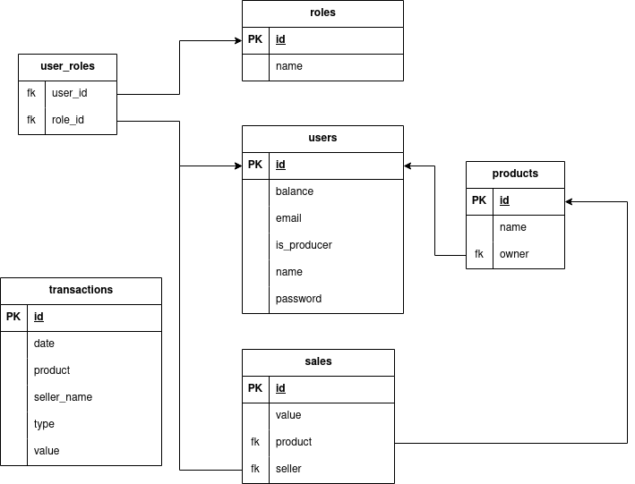

# Financial Transactions Upload and Management System

This is a system designed to upload financial transactions, integrated into the Hubla ecosystem, such as sales made by producers or affiliates, and commissions received or paid. In addition, the system allows users to view the balance of their accounts and the history of all transactions carried out.

The system consists of a frontend in React and a backend in Spring, and runs on Docker containers. To run the system, just run the docker-compose up command in the root of the directory.

## Features

- Upload of financial transactions
- Visualization of user account balance
- View the history of all financial transactions

## Technologies

- React
- Spring
- Docker
- MySQL

## How run

To run the system, make sure you have Docker and docker-compose installed on your machine and run the following command in the root of the directory:


``` docker-compose up ```

This will start the frontend, backend and database in Docker containers. The frontend will be accessible from http://localhost:3000, while the backend will be accessible from http://localhost:8085.

## Documentation

### Backend API
To document the backend API, we use Swagger. You can access the API documentation at http://localhost:8085/swagger-ui/index.html when the backend service is running. There you will find all the API endpoints, along with the expected parameters and responses. This makes it easier to understand how the API works and how to interact with it.

### Database
The data model for this database includes the following tables and columns:

- users table with columns id, balance, email, is_producer, name, and password.
- sales table with columns id, value, product, and seller.
- products table with columns id, name, and owner.
- user_roles table with columns user_id and role_id.
- roles table with columns id and name.
- transactions table with columns id, date, product, seller_name, type, and value.

The users table holds information about registered users, including their unique id, balance, email, whether they are a is_producer or not, name, and password.

The sales table tracks the sales made by users, including the id of the sale, the value of the sale, the product sold, and the user who made the sale.

The products table lists the available id and name of each product, along with the user who created it.

The user_roles table is used to assign roles to users, with user_id and role_id columns linking to the respective tables.

The roles table defines the different roles available for users, with id and name columns.

The transactions table records all the financial transactions, including the id of the transaction, the date of the transaction, the product involved, the seller of the product, the type of transaction, and the value of the transaction.

This data model allows for tracking users, their sales, the products they sell and buy, their roles, and all the financial transactions that take place.

Check the diagram below:



### Contact 
This project was developed by Mateus Fonseca Piris. If you have any questions or suggestions, please contact me at mateusfonseca27@yahoo.com.br.